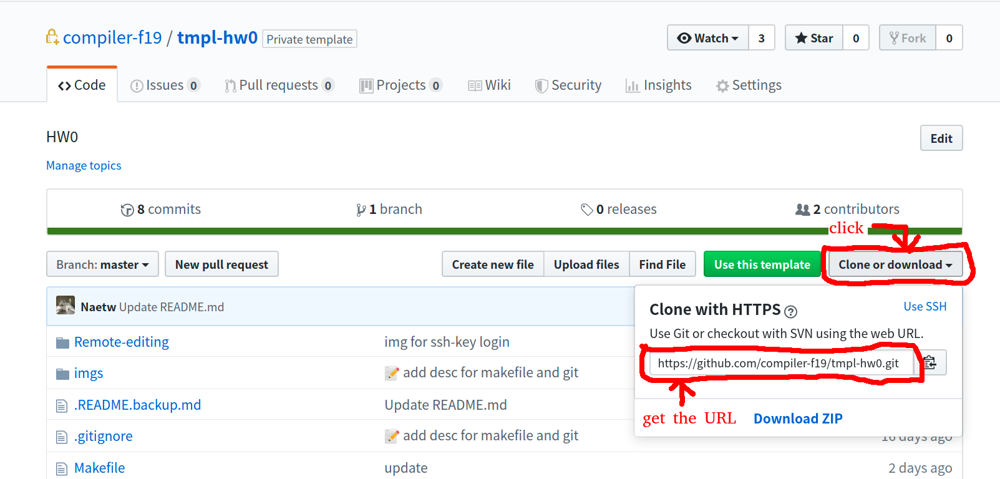

# HW0 環境熟悉

|||
|:-:|:-:|
|Name|詹凱傑|
|ID|0716049|
|GitHub|chan9988|
|Email|kai9988ckc.cs07＠nctu.edu.tw|
> **請修改 `student_info.ini` 並執行程式更新資訊**

+ Last Make: `2020-09-21 12:00:04 PM`

+ Docker ENV FLAG: `DOCKER_ACTIVATED`

---

這次程式作業有 4 個目的：

1. 確保你的環境正確，能用在以後的作業
2. 能使用 Docker
3. 能使用 GNU Make
4. 能使用 Git 來管理專案並繳交作業


## 環境介紹

### Docker

為了確保同學做作業時不會遇到電腦環境問題干擾，最簡單的方式就是開出一個虛擬化後的 (virtualized)環境，讓大家在相同的平台上開發。

舉個例子，同學較常聽到的虛擬化產品是從網卡、處理器、顯示卡等等硬體層級開始模擬的 VirtualBox。不過在追求效率最大化以及部署便捷性的趨勢下，容器(Container)成為近年來發展最為迅速的虛擬化技術。與 VirtualBox 類別產品最大的不同是，容器技術是從作業系統層級開始進行虛擬化，不需要再用各種奇技淫巧來加速模擬硬體的過程，讓虛擬機的邊際成本下降了許多。

我們在這門課程使用到的 Docker 就是基於 Container 技術家族的產品。

在這裏我們會介紹這學期作業所需要的 Docker 基礎知識跟名詞，為了降低新手們的認知負擔，我們**已經把所有的指令打包起來**，同學只要理解如何使用我們給的流程，不需要親手操作 Docker 。而接下來的基礎介紹只是讓你知道一些基本概念。遇到問題時比較有方向解決。

**名詞解釋**

+ docker image :

    一個 image 代表的是整個封裝完成的檔案系統（包含函式庫）。是我們拿來發布環境使用的檔案

+ docker container:

    拿到 image 之後，系統可以根據 image 內容產生出一個當初指定的環境，每一個執行中的系統單位叫做一個 container

**Docker適用的環境**

追根究底，Container 技術中你的虛擬化環境還是會與原本主機共享 Kernel，根本上還是依賴著你電腦上 OS 的調配能力。一般來說，如果要在 Windows 等非 Linux kernel 上支援 Container 技術都會需要另外一層的努力。(比如說安裝某些額外產品)

### Git

撰寫專案的本質就是不停更新原始碼。但有時總要進行難以回復的改動，為求保險你可能會想保存改動前的程式碼，確保改壞後還能重新開始，這就是版本控管的基礎想法之一。

這種時候你會怎麼做？最簡單方法是改動前先複製一份原始碼並壓縮成一個檔案保存下來。簡單又暴力，甚至某些中小企業仍在專案管理上使用這種方式。但這種保存源碼狀態的方法會遇上幾個狀況:

+ 隨著專案的發展，開發者必須手動管理一堆壓縮檔，單檔案密名命名就成了件難事，更為棘手的情況是: 一個月後甚至回想不起來那 他x的 100 個壓縮檔名稱分別代表什麼樣的專案狀態，好比說:`project_final-fianl_v99.zip`

+ 新功能需要用到多個過去寫過而屬於不同版本的程式碼 - 你必須打開每個版本的專案，手動比較差異來確保正確性

這些情況遇上幾遍後就會發現自己花費太多時間在雜事上，非常干擾工作流程，最後導致時間不夠、難以專心，變的一事無成，就如同正在寫這篇文件的助教一樣 QQ

人生很難，沒必再讓他更難下去，版本控管工具正站在一旁，準備解救你的悲哀人生。


Git 最初是為了 Linux 核心開發而誕生出的版本控管工具，在它的概念中，所有要被管理的狀態都會被紀錄成一個個提交紀錄 ( Commit )，開發期間只需要不停的紀錄哪些新改動要被放到新版本之中，並且透過指令將狀態寫入歷史來讓 Git 管理、比較不同版本間的狀態差異，甚至必要時能讓開發者能夠快速將專案跳回特定 Commit 時的狀態。

詳細的使用介紹，請參照官方文件，[為你自己學 Git](https://gitbook.tw/chapters/using-git/init-repository.html) or [Pro Git](https://git-scm.com/book/zh/v2)

### Make

**(GNU Make)**

在編譯器設計這堂課中，不會直接寫編譯器的原始碼，而是利用工具來幫助撰寫編譯器的功能，工具會產生你撰寫的編譯器的 C 語言程式碼，最後再利用 GNU Make 來建構整支編譯器程式。

在專案中通常會處理多個原始碼，而檔案間也會有不同的相依性，我們會利用 `GNU Make`( 簡稱 Make ) ，一支自動化管理原始碼相依性的程式來輔助開發。Make 的運作方法很簡單，只要在專案目錄下用終端機執行 `make <target>` 類型指令，Make 就會自動尋找檔案名稱為 Makefile 或 makefile 的文字檔（沒有副檔名），依照其內容執行 `<target>` 對應的指令。

更多有關 Make 的內容，可以參考 [官方文件](https://www.gnu.org/software/make/manual/make.html) 或是由阮一峰撰寫的 [Make 命令教學](http://www.ruanyifeng.com/blog/2015/02/make.html)，建議在撰寫後續作業時可以邊學邊做。

## Step0. 安裝 Docker

<details>
<summary> Windows (Click to expand!)</summary>

如果你是 Windows 用戶，請用 [VMware Workstation Player](https://www.vmware.com/products/workstation-player/workstation-player-evaluation.html) 安裝 [Ubuntu 18.04](https://ubuntu.com/download/server/thank-you?country=TW&version=18.04.4)。請不要直接在 Windows 下安裝使用 Docker，因為本門課還會用到其他 Unix 工具。Ubuntu 下安裝 Docker 可以參考[這篇教學](https://www.digitalocean.com/community/tutorial/show-to-install-and-use-docker-on-ubuntu-18-04)。

進入虛擬機的 Ubuntu 之後，為了讓你的 Docker 可以不用用 `sudo`，請執行以下指令：

```sh
    sudo groupadd docker
    sudo gpasswd -a $USER docker
    sudo service docker restart
```
</details>

<details>
<summary> Linux (Click to expand!)</summary>

Linux 用戶可以參考 [Docker 文檔](https://docs.docker.com/install/linux/docker-ce/centos/)（左側選單可以選擇 Linux 發行版）。

為了讓你的 Docker 可以不用用 `sudo`，請執行以下指令：

```sh
sudo groupadd docker
sudo gpasswd -a $USER docker
sudo service docker restart
```
</details>

<details>
<summary> macOS (Click to expand!)</summary>

請參考 [Docker 文件](https://docs.docker.com/docker-for-mac/install/) 下載安裝 Docker。
</details>

## Step1. 安裝 Git

<details> <summary>Windows</summary>
進入 Ubuntu 虛擬機之後

```shell
apt-get install git
```
</details>

<details> <summary>Ubuntu(Linux)</summary>

```shell
apt-get install git
```

</details>

<details> <summary>OSX</summary>

推薦你先安裝 brew, OSX 上的套件管理程式

```shell
brew install git
```

安裝完之後使用 `git --version` 確認一下有沒有正確安裝
```shell
git --version
```

</details>

### 設定 Git / GitHub Account 連結

> 註：這個有沒有設定並不會影響作業繳交，但助教還是建議設定一下。

GitHub 是透過 email 信箱來認人的，若沒有設定 email，GitHub 就無法把你做的提交記錄 (commit) 關聯到你的帳號，也就會讓你的提交記錄在 GitHub 上變得醜醜的（原因請參考 [Why are my commits linked to the wrong user](https://help.github.com/en/articles/why-are-my-commits-linked-to-the-wrong-user)）：


若想要讓 GitHub 知道這個提交記錄是誰做的，就得設定好自己的 email（實際上單單設定 email 還是無法確認到底是誰做的 XD 可見 [git-blame-someone-else](https://github.com/jayphelps/git-blame-someone-else)）：

請使用以下指令（**email 請改成你自己的**）：

```Shell
git config --global user.name your_github_id
git config --global user.email "email@example.com"
```

接著確認是不是把 email 正確地設定好了：

```Shell
git config --global user.email
email@example.com
```

最後則是在 GitHub 帳號資訊中加入你剛剛填入的 email 信箱，可見 [Setting your commit email address on GitHub](https://help.github.com/en/articles/setting-your-commit-email-address#setting-your-commit-email-address-on-github)。

如此一來，往後你電腦進行的提交記錄都會使用上面填好的 email 資訊。（若想做更多的事情可以參考 [Setting your commit email address](https://help.github.com/en/articles/setting-your-commit-email-address)）

## Step2. 使用 git clone 複製一份你的 HW0 Repository

進入你的 Repo 中找到要複製 Repo需要的網址，如下圖所示



在電腦中下指令：
```Shell
git clone <剛剛得到的 Repo 網址>
```

完成後就會在看到一份你的 HW0 的資料夾，接著進入該資料夾繼續完成下列步驟。

## Step3. 獲取 hw0 Docker image

首先請先到你的 hw0 專案資料夾下使用 `make docker-pull` 指令來拿取 hw0 的 docker image。

```shell
$ make docker-pull

docker pull ianre657/compiler-s20-hw0:latest
latest: Pulling from ianre657/compiler-s20-hw0
Digest: sha256:f9fe0fdb4d1d048414b3e40f11097b0548fc6be4e06fc4f5a1c1319557c29dd0
Status: Image is up to date for ianre657/compiler-s20-hw0:latest
docker.io/ianre657/compiler-s20-hw0:latest
```

使用以下指令來檢查是否安裝在系統上:

```shell
$ docker image ls | grep hw0

ianre657/compiler-s20-hw0      latest              d1457c631c72        8 days ago          220MB
```
> 如果遇到錯誤的話請檢查你的 docker daemon 是否有開啟

**這門課中每次作業都需要用 `make docker-pull` 來拿取個別的 docker image**

再使用 `./activate_docker.sh` 來使用下載好的 docker image 進入作業環境。

```shell
$ ./activate_docker.sh
# 進入 Docker
```

Docker 內部的檔案空間其實是跟你的電腦分開的，不過為了迎合作業需求，在執行 `./activate_docker.sh` 的時候腳本會把執行時的當前目錄映射到 Docker 內部使用者的家目錄中。

```shell
# 在 Docker 之中
$ ls
# 顯示跟 HW0 一樣的檔案內容
```

此時專案資料夾和 Docker 內部檔案是共享的，所以使用 Docker 感覺只是切換系統狀態而已。

我們推薦的使用方式是：
- 開啟一個專門跑 Docker 的終端機，編譯動作都在 Docker 環境下。
- 在原本系統開啟慣用編輯器來寫作業。所有在編輯器撰寫的改動都會即時映射到 Docker 環境中。

## Step4. 填入正確資訊並使用 `Make`

### 修改 `student_info.ini` 更新 `README.md` 檔案

**什麼是 README.md ?**

每個工具或是專案都會有他的使用說明書，當在 GitHub 中瀏覽某個專案或某個資料夾時，網站會預設讀取並顯示該資料夾下的 `README.md` 檔案，副檔名 `md` 代表這個文字檔內的寫作格式屬於 Markdown。Markdown 是一種語法相對簡單，被大量使用的標記式語言，這次的 HW0 說明文件、以及這學期的課程網站以及**未來同學寫的報告都是使用 Markdown 撰寫**，值得各位花時間認識一下。

推薦各位可以直接上 [HackMD](https://hackmd.io/) 練習 Markdown，裡面也有一些簡單的[教學](https://hackmd.io/getting-started)。HackMD 是誕生於台灣北科大的新創公司，因此相較其他線上的編輯器有更好的中文的支援度。

**動動手**

在這次作業中你必須透過修改 Makefile 檔案，將其資料修改成正確的個人資訊並呼叫 `GNU Make` 來更新專案目錄下 README.md 的內容。別擔心，每位同學的作業專案 (Repository) 只有自己跟助教能夠存取。

打開 `student_info.ini` 檔案, 分別要修改的變數的定義是:

- name : 你的中文姓名
- id : 你交大的學號
- github_handle : 你的 GitHub 帳號
- email : 你在 GitHub 使用的主要電子信箱

##### 更新後的 student_info.ini 範例：

```ini
[info]
    name = 編義氣
    id = 0612999
    github_handle = nctuGreatAgain
    email = nctuGreatAgain@gmail.com
```
> 請改成你的個人資訊

在 student_info.ini 填入正確資訊後，請 __`在 docker 環境下`__ 的主目錄使用指令 `make`，再檢查一下你的 README.md 開頭是否已經更新成你的資訊了。

> 如果不在 docker 環境中使用 `make` 會預設顯示錯誤，這是為了讓你知道怎樣在 docker 內完成作業


使用 Make 的好處是新的使用者不太花費精神理解整個專案的建置邏輯。不知道怎麼辦？ `make` 一下就不是問題，最多只要閱讀 Makefile 中寫好的規則，就能夠快速建立起整個專案。請注意，**往後的作業也都會使用 Make 來編譯各位的專案**。

## 檢查完成的作業版本

完成之後，你的 README.md 中除了個人資訊之外，也會同時更新這兩個欄位:

+ Last Make: `2020-09-21 12:00:04 PM`
+ Docker ENV FLAG: `DOCKER_ACTIVATED`

正確的環境下這裡會顯示你的最後編譯時間以及 `DOCKER_ACTIVATED`字樣

> 你可以使用 `make clean` 指令將專案變回原本的樣子。

## Step5. 使用 Git 繳交作業到 GitHub


### 繳交作業

當你看到這裏時，比起最開始收到作業時的模樣，這個專案的 `Makefile` 以及 `README.md` 已經被你改動過了。接下來要將這些改動過的程式碼加入到新版本之中，納入 Git 的控管範圍內，從此成為歷史文件，跟中英聯合聲明一樣。

首先使用 `git status` 看一下當前狀態

```Shell
$ git status

On branch master
Your branch is up to date with 'origin/master'.

Changes not staged for commit:
    (use "git add <file>..." to update what will be committed)
    (use "git checkout -- <file>..." to discard changes in working directory)

    modified:   Makefile
    modified:   README.md

no changes added to commit (use "git add" and/or "git commit -a")
```

使用 `git add student_info.ini README.md` 將修改過的文件加入準備成為 Commit 的資料。 也可以改用語法更簡單的 `git add .` 指令來直接加入整個當前資料夾狀態。

```Shell
git add student_info.ini README.md
```

使用 `git status` 指令再確認一次專案狀態。
```Shell
$ git status
Your branch is up to date with 'origin/master'.

Changes to be committed:
    (use "git reset HEAD <file>..." to unstage)

    modified:   student_info.ini
    modified:   README.md
```

使用 `git commit -m "<你的編輯大綱>"` 來確認提交 Commit。 `-m` 選項的意思是，將後面提供的字串當成訊息附加在這次 Commit 中，讓你未來在瀏覽時能快速了解這次 Commit 所代表的意義。

```Shell
$ git commit -m ":pencil: update student information"

[master 25b95d1] :pencil: update student information
    2 files changed, 8 insertions(+), 8 deletions(-)
```
使用 `git push` 將自己的專案跟 GitHub 代管的遠端資料同步。
```Shell
$ git push

Enumerating objects: 7, done.
Counting objects: 100% (7/7), done.
Delta compression using up to 4 threads
Compressing objects: 100% (4/4), done.
Writing objects: 100% (4/4), 511 bytes | 255.00 KiB/s, done.
Total 4 (delta 2), reused 0 (delta 0)
remote: Resolving deltas: 100% (2/2), completed with 2 local objects.
To https://github.com/compiler-f19/HW0.git
    a80fff2..25b95d1  master -> master
```

這時候到自己的 GitHub repo 應該就能看到你的提交記錄。

> 這門課的推薦做法是每次提交 Commit 後直接使用 `git push` 來跟 GitHub 遠端同步。

順道一提，這學期作業繳交的時間判定，是你利用 `git push` 更新 GitHub repo 的時間點，而不是提交記錄中的時間點，請各位在繳交期限前，確保已經將你工作目錄底下的提交記錄都 push 上 GitHub repo，避免發生遲交爭議。

### 批改環境

這學期所有作業都會使用助教提供的 Docker Image 環境進行批改並評分，無論同學使用何種環境進行開發，**務必確保**自己的作業能夠在 Docker Image 中**用我們指定的方式**成功編譯。
